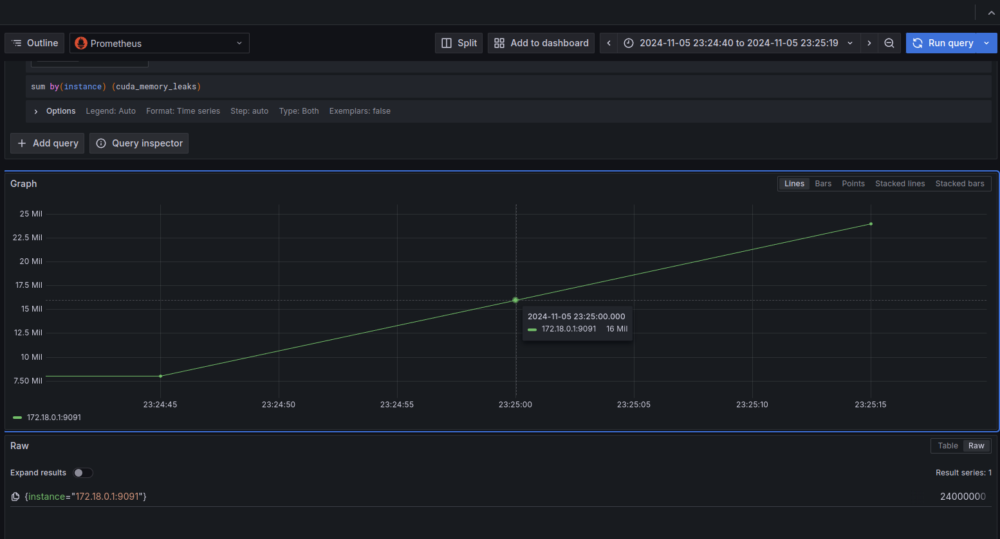

# GPUprobe

GPUprobe *(GPU probe, GP-uprobe)* provides utilities for observability
of GPU behavior via their interaction with the Cuda runtime API by leveraging 
eBPF uprobes.

This repo provides the source code for `gpuprobe-daemon` - a lightweight binary
that collects data on the CUDA runtime by leveraging eBPF uprobes _(user-space 
probes)_.

The project, although experimental, provides several cool features already
which are described below.

For information on building and running, refer to the 
[short guide](#building-and-running) on the subject.

## Usage

```
Usage: gpu_probe [OPTIONS]

Options:
      --memleak
          Detects leaking calls to cudaMalloc from the CUDA runtime API
      --cudatrace
          Maintains a histogram on frequencies of cuda kernel launches
      --bandwidth-util
          Approximates bandwidth utilization of cudaMemcpy
      --metrics-addr <METRICS_ADDR>
          Address for the Prometheus metrics endpoint [default: 0.0.0.0:9000]
      --display-interval <DISPLAY_INTERVAL>
          Interval in seconds for displaying metrics to stdout [default: 5]
  -h, --help
          Print help
  -V, --version
          Print version
```

## High-level Design

Metrics are exported in [OpenMetrics](https://github.com/prometheus/OpenMetrics/blob/main/specification/OpenMetrics.md) 
format via an http handler, which is intended to be scraped by Prometheus. This
allows for seamless integration with your favorite observability stack, e.g.
Grafana.



These metrics are also displayed periodically to stdout.

```
sudo ./gpu_probe --memleak --display-interval 3 --metrics-addr 0.0.0.0:9000
========================
2024-12-02 12:36:56

num_successful_mallocs:  0
num_failed_mallocs:      0
num_successful_frees:    0
num_failed_frees:        0
per-process memory maps:

========================
========================
2024-12-02 12:36:59

num_successful_mallocs:  3
num_failed_mallocs:      0
num_successful_frees:    0
num_failed_frees:        0
per-process memory maps:
process 246649
        0x00007989d8000000: 8000000 Bytes
        0x00007989dcc00000: 8000000 Bytes
        0x00007989dd400000: 8000000 Bytes

========================
========================
2024-12-02 12:37:11

num_successful_mallocs:  3
num_failed_mallocs:      0
num_successful_frees:    0
num_failed_frees:        0
per-process memory maps:
process 246649
        0x00007989d8000000: 8000000 Bytes
        0x00007989dcc00000: 8000000 Bytes
        0x00007989dd400000: 8000000 Bytes

========================
========================
2024-12-02 12:37:14

num_successful_mallocs:  3
num_failed_mallocs:      0
num_successful_frees:    2
num_failed_frees:        0
per-process memory maps:
process 246649
        0x00007989d8000000: 8000000 Bytes
        0x00007989dcc00000: 0 Bytes
        0x00007989dd400000: 0 Bytes

========================
========================
2024-12-02 12:37:17

num_successful_mallocs:  3
num_failed_mallocs:      0
num_successful_frees:    2
num_failed_frees:        0
per-process memory maps:
process 246649
        0x00007989d8000000: 0 Bytes # note: this allocation is freed by process terminating
        0x00007989dcc00000: 0 Bytes
        0x00007989dd400000: 0 Bytes

========================
```

The various features are opt-in via command-line arguments passed to the 
program at launch. 

**E.g.** running `gpuprobe --memleak` will only attach the uprobes needed for
the memleak feature, and only display/export relevant metrics.

## Memleak feature

This utility correlates a call to `cudaFree()` to the associated call to 
`cudaMalloc()`, allowing for a measurement of the number of leaked bytes 
related to a Cuda virtual address.

## CudaTrace feature

This utility keeps stats on the launched kernels and number of times that they
were launched as a pair `(func_addr, count)`. It can be thought of and
aggregated as a histogram of the frequencies of kernel launches.

## Bandwidth utilization feature

This feature approximates bandwidth utilization on the bus between host and 
device as a function of execution time and size of a `cudaMemcpy()` call.

This is computed naively with: `throughput = count / (end - start)`

Note that this only plausibly works for host-to-device *(H2D)* and
device-to-host *(D2H)* copies, as only these calls provide any guarantees of
synchronicity.

This feature is not yet exported. Below you will find a sample output of an 
older iteration that simply wrote the results to stdout.

```
GPUprobe bandwidth_util utility
========================


Traced 1 cudaMemcpy calls
        H2D 3045740550.87548 bytes/sec for 0.00263 secs
========================

Traced 2 cudaMemcpy calls
        H2D 2981869117.56429 bytes/sec for 0.00268 secs
        D2H 3039108386.38160 bytes/sec for 0.00263 secs
========================
```

## Building and Running

An eBPF compatible Linux kernel version is required for running GPUprobe, as
well as `bpftool`.

A `vmlinux.h` file is required for the build process, which can be created
by executing the following command from the project root:

```bash
bpftool btf dump file /sys/kernel/btf/vmlinux format c > src/bpf/vmlinux.h
```

Following that, you should be able to build the project.

```bash
cargo build
```

Root privileges are required to run the project due to its attaching of eBPF
uprobes.

```bash
sudo ./gpu_probe # --options
```
